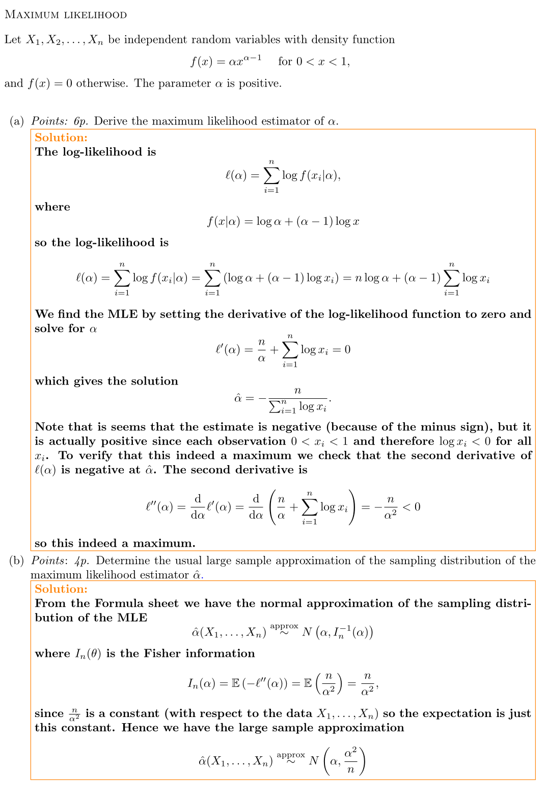

### Problem 1

**Problem 1a)** see Example 8.1 in [Bayesian Learning - the prequel](https://github.com/mattiasvillani/BayesianLearningBook/raw/main/pdf/PreBayesBook.pdf).

**Problem 1b)** see Problem 1 in Section 8.4 in [Bayesian Learning - the prequel](https://github.com/mattiasvillani/BayesianLearningBook/raw/main/pdf/PreBayesBook.pdf).

**Problem 1c)** see Problem 1 in Section 8.4 in [Bayesian Learning - the prequel](https://github.com/mattiasvillani/BayesianLearningBook/raw/main/pdf/PreBayesBook.pdf).

**Problem 1d)** The likelihood is $$
p(s \vert \theta) = \binom{n}{s}\theta^s(1-\theta)^f
$$

which is the binomial distribution, so we can use the `dbinom` function in R:

```{r}
n = 20
s = 8
thetaGrid = seq(0.001, 0.999, length = 1000) # grid of values where we plot the likelihood
like = dbinom(x = s, size =n, prob = thetaGrid)
plot(thetaGrid, like, type = "l", ylab = "likelihood", xlab = "theta")
```

The MLE is $\hat\theta = s/n$ with asymptotic distribution from the general asymptotic distribution of the MLE

$$
\hat\theta \overset{\mathrm{approx}}{\sim} N(\theta, \mathcal{J}^{-1}_n(\hat\theta))
$$

where from problem 1b), the observed information is

$$
\mathcal{J}^{-1}_n(\hat\theta) = \frac{n}{p(1-p)}
$$

so $$
\hat\theta \overset{\mathrm{approx}}{\sim} N\Big(\theta, \frac{\hat{\theta}(1-\hat\theta)}{n}\Big) 
$$

Note that this is a *sampling distribution* of the MLE, not the likelihood. In order to plot this we need to know the true value, which is of course not known. We may choose to set $\theta = \hat\theta = 8/20 = 0.4$ and plot the normal approximation

$$
N\Big(\hat\theta, \frac{\hat{\theta}(1-\hat\theta)}{n}\Big) = N\Big(0.4, \frac{0.4 \cdot 0.6}{20}\Big) = N(0.4, 0.12)
$$

where $0.12$ is a variance here, not a standard deviation.

Here is the plot

```{r}
n = 20
s = 8
thetaHat = s/n # This is the MLE
thetaHatGrid = seq(0.001, 0.999, length = 1000) # grid of values 
sampdist = dnorm(thetaHatGrid, mean = thetaHat, sd = sqrt(thetaHat*(1-thetaHat)/n))
plot(thetaGrid, like, type = "l", ylab = "sampling density", xlab = "thetaHat")
```

### Problem 2



### Problem 3

**Problem 3a)**

The CDF $F(x)$ is the anti-derivative of the PDF $f(x)=5x^4$ hence $F(x)=x^5$. The inverse CDF method solves the following equation for $u \sim Unif(0,1)$

$$
F(x)=x^5 = u
$$

which has solution $x=u^{1/5}$. So we can simulate $X$ from $f(x)=5x^4$ by simulating a uniform random number $u$ (using `runif` in R) and just compute the inverse CDF value $x=u^{1/5}$. Here is the code, where I simulate 10000 draws and plot a histogram and kernel density estimate. I also overlay the true density, to check that my code is doing the right thing.

```{r}
nSim = 10000
u = runif(n = nSim) # a whole vector of Unif(0,1) numbers
x = u^(1/5)         # a whole vector of draws from f(x)
hist(x, 50, freq = F, xlab = "x", ylab = "density", col = "cornflowerblue", main = "")
kde = density(x) # this can go outside the support (0,1)
lines(kde$x, kde$y)
xgrid = seq(0.001, 0.999, length = 1000)
exactdensity = 5*xgrid^4
lines(xgrid, exactdensity, col ="indianred", lw = 2)
legend("topleft",
       legend = c("Histogram", "Kernel density", "Exact"),
       fill = c("cornflowerblue", NA, NA),
       border = c("black", NA, NA),
       lty = c(NA, 1, 1),
       lwd = c(NA, 2, 2),
       col = c(NA, "black", "indianred"),
       bty = "n")
```

**Problem 3b)** We already have draws from the density $f(x)$ from Problem 3a). The Monte Carlo estimate is then the mean of the function values $\exp(x^{(i)})$ where $x^{(i)}$ is the $i$th draw. Let $\mu$ denote the sought mean $\mathbb{E}(\exp(X))$ the Monte Carlo estimator is then

$$
\hat\mu = \frac{1}{n_{sim}}\sum_{i=1}^{n_{sim}} \exp(x^{(i)}),
$$

where $n_{sim}$ is the number of Monte Carlo draws. This is the whole code (note that R is vectorized, so exp(x) where x is a vector that computes the `exp()` function for all elements in x).

```{r}
mean(exp(x))
```

We can check if the Monte Carlo estimate seems to have converged (in probability) by plotting the estimate based on a single draw, then based on two draws, then based on three draws, and so on, all the way to the estimate based on all 10000 draws. These estimates based on more and more draws should "settle down". This is seen in the plot below (there are smarter ways to compute this that avoids the loop, but this is reasonable fast for this simple problem).

```{r}
function_values = exp(x) # this is a vector with exp(x) values 
mc_estimates = rep(0,nSim)
for (i in 1:nSim){
  mc_estimates[i] = mean(exp(x[1:i]))
}
plot(1:nSim, mc_estimates, type = "l", ylab = "Monte Carlo estimate", xlab = "iteration")
```

**Problem 3c)** The numerical standard error of the Monte Carlo estimate is$$
\sqrt{\frac{\mathbb{V}(\exp(X))}{n_{sim}}}
$$

where $X\sim f(x)$ the density given in the problem. Here $n_{n_{sim}}=10000$ is the number of Monte Carlo draws. The variance in the numerator can be estimated by the usual sample variance of the function values. Here we go:

```{r}
varianceFunctionValues = var(exp(x))
se = sqrt(varianceFunctionValues/nSim)
message("The Monte Carlo standard error is ", se)
```

This standard error describes the "usual" deviation from the true value that you can expect to get in simulation.

**Problem 3d)** The central limit theorem applies here since the Monte Carlo estimator is a sample mean. Denote the expectation that we are trying to estimate by $\mu = \mathbb{E}(\exp(X))$ and let the Monte Carlo estimator be denoted

$$
\hat\mu = \frac{1}{n_{sim}}\sum_{i=1}^{n_{sim}}\exp(X^{(i)})
$$The central limit theorem then says that

$$
\hat\mu \overset{approx}{\sim}N\Big(\mu, \frac{\mathbb{V}(\exp(X))}{n_{sim}}\Big) 
$$ and the variance of this distribution is the square of the standard error computed above.

### Problem 4

**Problem 4a)** The bounding constant must be a constant that is at least as large as the largest density value. Let us therefore find the maximum of the density. If $\alpha>1$ then the mode of the density is at $x=1$ (since the density is monotonically increasing in $x$) so the highest density value is $f(1)=\alpha(1)^{\alpha-1}=\alpha$. So $M=\alpha$ is a suitable bounding constant here.

**Problem 4b)**

```{r}
alpha = 5
nSim = 10000
xStar = runif(nSim) # these are the proposal draws from q()
M = alpha           # bounding constant

# This is the target density that we want to simulate from
pDensity <- function(x, alpha = 5){
  alpha*x^(alpha-1)
} 

# This is the proposal density. 
# A uniform distribution with density equal to 1 for all x
qDensity <- function(x){
  return(1)
}

xDraws = rep(0, nSim) # storage for the draws
for (i in 1:nSim){
  xStar = runif(1) # this is the proposal/candidate draw
  accProb = pDensity(xStar) / (M * qDensity(xStar)) # p(xStar)/(M*q(xStar))
  u = runif(1)
  if (u < accProb){
    xDraws[i] = xStar # draw is accepted!
  }else{
    xDraws[i] = NA # draw is rejected, insert NA
  }
}
nRejected = sum(is.na(xDraws))
# !is.na(xDraws) picks out all values that are not NA
hist(xDraws[!is.na(xDraws)], freq = F, main = "") 
xGrid = seq(0.001,0.999, length = 1000)
lines(xGrid, pDensity(xGrid), col = "indianred")
```

**Problem 4c)** It is not very efficient. The uniform distribution looks nothing like the target density, so we have to choose a large bounding constant $M=\alpha=5$ here. We therefore get many rejections:

```{r}
message(nRejected, " draws were rejected out of the nSim = ",nSim," draws")
```

In fact, the expected proportion of rejected draws is $1/M= 1/5 = 0.2$. So only 20% can be expected to the accepted. It would have been better with a proposal distribution that is closer to the target density, that is, similar shape.

**Problem 4d)** Here is the importance sampling estimate

```{r}
xDraws = runif(nSim)
ISweights = pDensity(xDraws)/qDensity(xDraws)
mean(ISweights * exp(xDraws))
```

The weights should ideally be around one. In particular, it is bad (large variance of the IS estimator) if some weight are much larger than others. Here is a histogram of the weights

```{r}
hist(ISweights, freq = F)
```

Or the log weights (easier to see when some weights are really large. A log weight around zero is ideal)

```{r}
hist(log(ISweights), freq = F)
```
