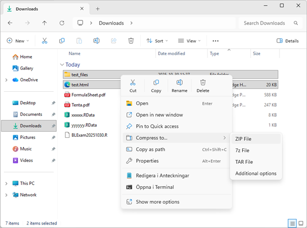
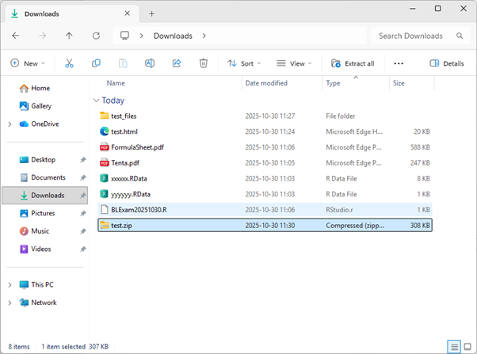

You can submit your exam solutions using *either*:

- html

- pdf (works since late October)

Below are instructions for each type of file.

::: callout-important
## Files can only be submitted from the `Downloads` folder

Save or move all exam files to the `Downloads` folder before submitting your final solutions.
:::

## pdf

Render the Quarto file to pdf (`format: pdf` in the so called YAML at the top of your Quarto file) and submit the pdf file. No extra files needed. It may take a minute on the first render, so try to render to pdf early in the exam, to make sure it works.

## html

When you render to html (`format: html` in the so called YAML at the top of your Quarto file) RStudio produces a html file **and** a folder in the same directory, containing figures and other things. **You need to submit both the html file and this folder with graphics**. To do this, you need to compress all files into a .zip file. Select all files and right-click to compress to a .zip file, as illustrated by the two figures below. Then submit only the .zip file.

|                                |                                |
|--------------------------------|--------------------------------|
| {width="300"} | {width="300"} |